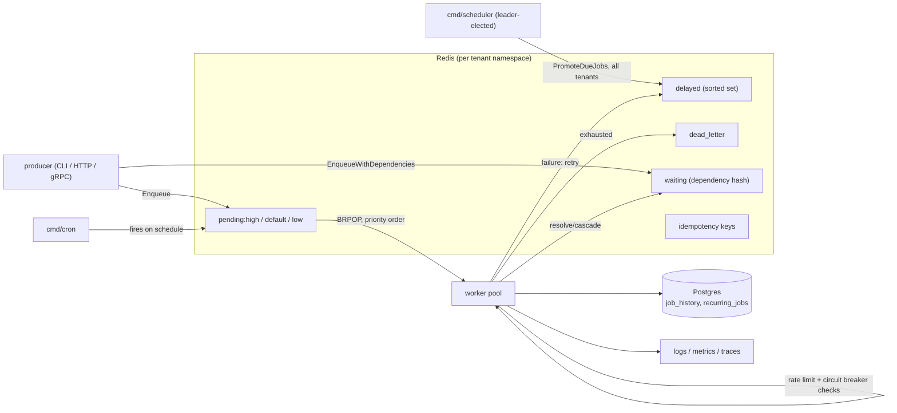

# Kairos

A distributed job queue built from first principles in Go — no off-the-shelf framework underneath. Every primitive (worker pools, retries, dead-lettering, delayed scheduling, dependency resolution) is written and documented explicitly, so using Kairos also means being able to read exactly how it works.

## Architecture



## Why "Kairos"

In ancient Greek, *chronos* is clock time — sequential, measured. *Kairos* is the right, opportune moment for something to happen. That's what this queue is about: not running things fast, but running each job at the moment it's actually meant to run — after dependencies resolve, once backoff has passed, ahead of lower-priority work when it matters.

## Documentation

- [Contributing guide](CONTRIBUTING.md) — setup, commands, commit conventions
- [Architecture Decision Records](docs/adr/README.md) — the reasoning behind all 24+ major design decisions
- [Landing page & docs site](https://github.com/harshalvk/kairos-site) — a browsable version of this documentation

## Quick start

```bash
git clone https://github.com/harshalvk/kairos.git
cd kairos
docker compose up -d --build   # redis, postgres, worker, jaeger, prometheus, grafana
make migrate                    # applies all schema migrations, tracked
```

Then either run the pieces individually (`make run-worker`, `make run-scheduler`, `make run-cron`), or write a Go program against `pkg/kairos` — the simplest way in:

```go
client, _ := kairos.New(kairos.WithRedisAddr("localhost:6379"))
defer client.Close()

client.Handle("send_email", func(ctx context.Context, j kairos.Job) error {
	var p struct{ To string `json:"to"` }
	j.Bind(&p)
	return sendEmail(p.To)
})

client.Enqueue(ctx, "send_email", map[string]string{"to": "you@example.com"})
client.Run(ctx, 30*time.Second)
```

## Two ways to integrate

Kairos has two distinct public entry points, for two different situations:

| | `pkg/kairos` | `pkg/kairosclient` |
|---|---|---|
| **Use when** | Your service is written in Go and runs the worker itself | You need to enqueue/inspect jobs from *outside* the Go process running Kairos (another service, another language via gRPC) |
| **Transport** | In-process — talks to Redis/Postgres directly | Network — gRPC to a running `cmd/worker` |
| **What it gives you** | `Handle`, `Enqueue`, `Run` — full control, register your own handlers | `Enqueue`, `QueueDepth`, `ListDeadLetter`, `RequeueDeadLetter` — remote operations only |

If you're building the worker itself, use `pkg/kairos`. If you're a producer service that just needs to push work into someone else's Kairos deployment, use `pkg/kairosclient`.

---

## Everything Kairos does, explained

### Core queue mechanics

**Priority queues.** Every job carries a priority — `High`, `Default`, or `Low`. Workers dequeue using a single Redis `BRPOP` call listing all three priority keys in order; Redis checks them left-to-right and returns from the first non-empty one, atomically. An urgent job never waits behind a backlog of low-priority ones. *(Tradeoff: a sustained flood of high-priority jobs can starve lower ones — no fairness mechanism exists yet. See [ADR 0008](docs/adr/0008-priority-queues-via-multiple-redis-lists.md).)*
→ `examples/priority-queue`

**Job dependencies (DAGs).** A job can declare `DependsOn: []string{otherJobID}` — it stays parked in a waiting hash until every dependency completes successfully. If a dependency is permanently dead-lettered, everything transitively waiting on it is dead-lettered too, with a traceable error pointing back to the upstream failure. Resolution is O(1) via a reverse index ("who's waiting on me"), not a scan.
→ `examples/job-dependencies`

**Idempotency keys.** If a producer retries an enqueue call after a timeout (without knowing whether the first attempt succeeded), an idempotency key prevents the job from running twice. Claimed atomically via Redis `SETNX`, scoped by job type, with a TTL — this protects against near-term retries, not a permanent uniqueness guarantee.
→ `examples/resilience`

**Retries with exponential backoff.** A failed job's `Attempts` increments and it's rescheduled with `2^attempts` seconds of backoff (capped at 30s), stored durably in a Redis sorted set — not an in-memory timer, so a worker crash mid-backoff doesn't lose the retry. Once `MaxAttempts` is exhausted, the job moves to the dead-letter queue.
→ `examples/basic`

**Dead-letter queue.** Permanently-failed jobs land in a separate Redis list, inspectable/requeueable/purgeable via the CLI, the admin API, or the TUI. Requeuing resets the attempt count, on the assumption a human manually replaying a job wants a fresh set of retries.
→ `cmd/deadletter`, `cmd/tui`

**Recurring (cron) jobs.** Schedule definitions live in Postgres (`recurring_jobs` table), so they survive restarts and don't require a redeploy to change. `cmd/cron` loads enabled definitions at startup and fires a fresh job instance on each schedule tick, using the standard 6-field cron format (seconds included).
→ `examples/recurring-jobs`

### Resilience

**Rate limiting.** Each job type can have its own token-bucket rate limit, independent of worker concurrency — protects a downstream dependency's actual rate limit (e.g. an email provider capped at 10/sec) regardless of how many workers you run.
→ `examples/resilience`

**Circuit breaker.** Closed → open → half-open, per job type. After enough consecutive failures, the circuit opens and jobs of that type are deferred without even being attempted — sparing a struggling dependency further load. After a cooldown, exactly one trial job tests whether it's recovered.
→ `examples/resilience`

**Leader election.** `cmd/scheduler` (which promotes due delayed/retry jobs) uses a Redis `SETNX`-based distributed lock with a TTL, so exactly one instance is ever active across a cluster, with automatic failover if the leader crashes.
→ [ADR 0019](docs/adr/0019-leader-election-for-scheduler.md)

**Graceful shutdown.** On SIGTERM/SIGINT, workers stop picking up new jobs but let an in-flight job finish, bounded by a shutdown timeout so the process can't hang forever waiting on a stuck handler.

### Multi-tenancy

One Kairos deployment can serve multiple isolated tenants — every Redis key and Postgres row is namespaced by tenant, propagated through `context.Context` the same way logging and tracing are. Tenants are auto-registered on first use, no manual provisioning step. *(One worker pool instance currently serves exactly one tenant — see [ADR 0024](docs/adr/0024-multi-tenancy-via-context-propagated-namespace.md).)*
→ `examples/multi-tenancy`

### Interfaces

- **CLI** — `cmd/producer`, `cmd/deadletter` for scripting and one-off operations
- **Admin HTTP API** — REST endpoints (`chi` router) for queue depth, dead-letter management, enqueue — see `docs/adr/0016`
- **gRPC + public SDK** — a versioned proto service (`kairos.v1`) and `pkg/kairosclient`, for any external service to talk to Kairos over the network
→ `examples/grpc-client`
- **TUI** — an interactive terminal dashboard (`cmd/tui`, built on Bubble Tea) polling the admin API: live queue depth, dead-letter table, requeue-on-keypress

### Observability

**Structured logging.** Every log line is JSON (`slog`), enriched with `job_id`/`job_type`/`attempt` fields automatically once a job starts processing — no manual parameter threading.

**Metrics.** Prometheus counters, a histogram, and gauges on `:2112/metrics` — jobs processed by type/outcome, handler duration percentiles, pending queue depth, circuit breaker state. A pre-built Grafana dashboard ships in `docker-compose.yml`.

**Tracing.** OpenTelemetry spans exported to Jaeger. A `job.process` span wraps each job with a nested `job.handler` child span, so you can tell "slow because of the handler" from "slow because of Kairos's own overhead" at a glance.

### An alternative implementation, kept for comparison

`internal/streamqueue` reimplements the queue using Redis Streams + consumer groups instead of plain lists — closing the one real gap the primary list-based queue has (a job delivered to a worker that crashes mid-processing is otherwise lost). It's deliberately **not** wired into the primary worker pool; kept as a working, documented alternative rather than a wholesale migration. See [ADR 0001](docs/adr/0001-redis-list-over-streams-for-queue.md) and [ADR 0020](docs/adr/0020-redis-streams-alternative-implementation.md).
→ `examples/streams-vs-lists`

---

## Project structure

```
kairos/
├── proto/kairos/v1/          gRPC service definition
├── internal/
│   ├── job/                   core Job domain model
│   ├── queue/                  Redis queue: pending, dead-letter, delayed, dependencies, idempotency, tenant registry
│   ├── store/                   Postgres job history
│   ├── metrics/, logging/, tracing/   observability
│   ├── worker/                          worker pool orchestration
│   ├── ratelimit/, circuitbreaker/       resilience primitives
│   ├── scheduler/                         recurring job definitions
│   ├── streamqueue/                        Streams alternative (comparison)
│   ├── leaderelection/                      distributed lock
│   ├── tenant/                               multi-tenancy propagation
│   ├── config/                                centralized env config
│   ├── api/, grpcserver/                       HTTP + gRPC interfaces
├── pkg/
│   ├── kairos/                embed-in-your-Go-service client (start here)
│   ├── kairosclient/           out-of-process gRPC client SDK
│   └── kairospb/                generated protobuf/gRPC code
├── cmd/
│   ├── worker/                serves :2112 metrics, :8080 admin API, :9090 gRPC
│   ├── scheduler/, cron/       background processes
│   ├── producer/, deadletter/   CLI tools
│   ├── tui/                      terminal dashboard
├── examples/                  one runnable example per feature (see below)
├── migrations/                 tracked via golang-migrate
├── docs/adr/                    24+ architecture decision records
├── observability/, loadtest/     Grafana/Prometheus provisioning, k6 scripts
```

## Examples

Every feature above has a runnable example under `examples/`. Requires `docker compose up -d --build && make migrate` first.

| Run | Demonstrates |
|---|---|
| `go run ./examples/basic` | Enqueue → retry-on-failure → succeed, watching backoff in the logs |
| `go run ./examples/priority-queue` | High-priority jobs dequeued before low, regardless of enqueue order |
| `go run ./examples/job-dependencies` | A job that only becomes runnable once its dependency completes |
| `go run ./examples/resilience` | Idempotency keys, rate limiting, and the circuit breaker, back to back |
| `go run ./examples/recurring-jobs` | Registering a cron-style recurring job definition |
| `go run ./examples/multi-tenancy` | Two tenants' jobs, provably isolated from each other |
| `go run ./examples/streams-vs-lists` | The Streams alternative's crash-recovery via XCLAIM |
| `go run ./examples/grpc-client` | Enqueuing from an external process via the gRPC SDK |
| `go run ./examples/example-app` | The full `pkg/kairos` ergonomic API, start to finish |

## Requirements

Go 1.25+, Docker + Docker Compose, `golangci-lint`, `lefthook`, `go-arch-lint`.

## Known gaps

- One worker pool serves exactly one tenant — no cross-tenant routing within a single pool
- CLI tools (`cmd/producer`, `cmd/deadletter`) default to the `default` tenant only
- No authentication on the admin HTTP API or gRPC service — safe only on a trusted network
- No queue sharding — a single Redis instance is the current scaling ceiling

See [`docs/adr/`](docs/adr/README.md) for the full reasoning behind every tradeoff above.
